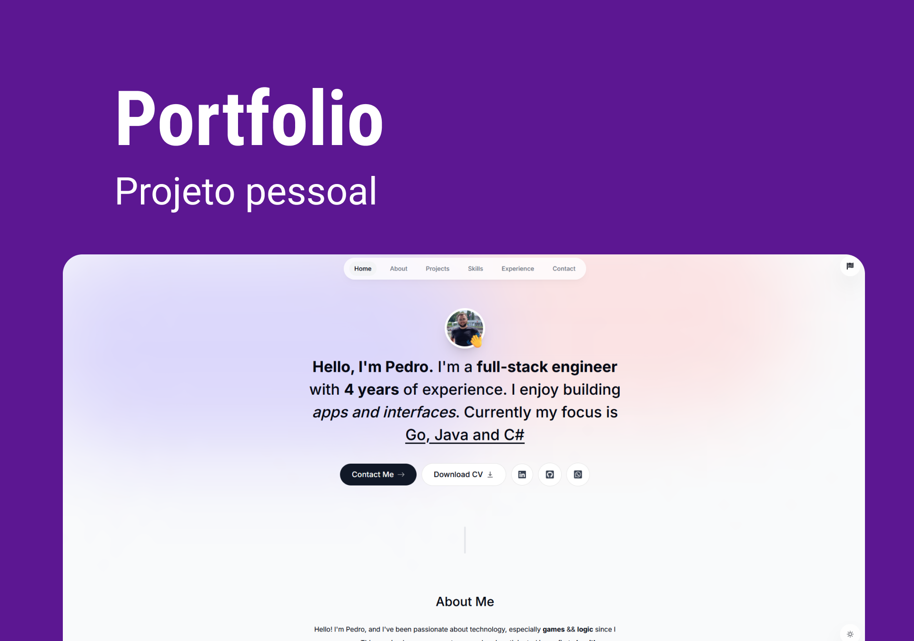

<h1 align="center" style="display: flex; align-items: center; width: 100%; justify-content: center; gap: 1rem;" >
    
Portfolio

</h1>

Este é o meu portfolio, para que eu possa mostrar a você quem eu realmente sou! Caso queira saber mais sobre mim, entre em contato. Bora criar algum projeto juntos? 

  <a href="#-tecnologias">Tecnologias</a>&nbsp;&nbsp;&nbsp;|&nbsp;&nbsp;&nbsp;
  <a href="#-projeto">Projeto</a>&nbsp;&nbsp;&nbsp;|&nbsp;&nbsp;&nbsp;
  <a href="#-layout">Layout</a>&nbsp;&nbsp;&nbsp;|&nbsp;&nbsp;&nbsp;
  <a href="#memo-licença">Licença</a>

  

 

  

## 🚀 Tecnologias

Esse projeto foi desenvolvido com as seguintes tecnologias:

- HTML, CSS e JavaScript
- Git e Github
- Bibliotecas:
    - [@react-email/components](https://react.email/docs/components/tailwind)
    - [@react-email/tailwind](https://react.email/docs/components/tailwind)
    - [clsx](https://github.com/lukeed/clsx)
    - [framer-motion](https://www.framer.com/api/motion/)
    - [lucide-react](https://lucide.dev/)
    - [next](https://nextjs.org/)
    - [react](https://reactjs.org/)
    - [react-dom](https://reactjs.org/docs/react-dom.html)
    - [react-hot-toast](https://react-hot-toast.com/)
    - [react-icons](https://react-icons.github.io/react-icons/)
    - [react-intersection-observer](https://www.npmjs.com/package/react-intersection-observer)
    - [react-vertical-timeline-component](https://www.npmjs.com/package/react-vertical-timeline-component)
    - [resend](https://resend.com/)
    - [tailwind-merge](https://www.npmjs.com/package/tailwind-merge)
    - [tailwindcss-animate](https://github.com/jamiebuilds/tailwindcss-animate)

## 💻 Projeto

O projeto de um portfolio é essencial para que o desenvolvedor possa mostrar seus projetos e apresentá-los de maneira organizada. Esse meu projeto me ajudou a expor meu trabalho para o ambiente profissional.

- [Visite o projeto online](https://portfolio-lake-five-28.vercel.app/)

## :memo: Licença

Esse projeto está sob a licença MIT.

---

## ✍ Author
 

    Made with 💜 by Pedro Henrique Klein

    
    

